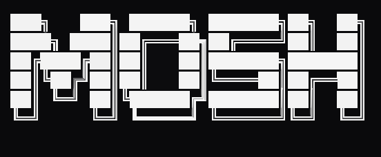

Mosh is a simple shell written in C. It provides a basic command-line interface for interacting with the operating system.

## Features

- Simple and lightweight.
- Provides a basic command-line interface.
- Supports built-in commands.
- Supports tab completion.

## Prerequisites

To build and run Mosh, you will need the following tools:

- **Meson:** A high-performance build system.
- **Ninja:** A small build system with a focus on speed.
- **A C compiler:** Such as GCC or Clang.

## Usage

- **Build and run the project:**

  ```bash
  # builds the project
  make build
  # runs the shell
  make run
  ```

## Built-in Commands

Mosh provides the following built-in commands:

- **`cd [directory]`:** Change the current working directory.
- **`pwd`:** Print the current working directory.
- **`exit`:** Exit the shell.

## Contributing

Contributions are welcome! If you find a bug or have a suggestion, please open an issue or submit a pull request.

## License

This project is licensed under the MIT License. See the [LICENSE](LICENSE) file for more information.
